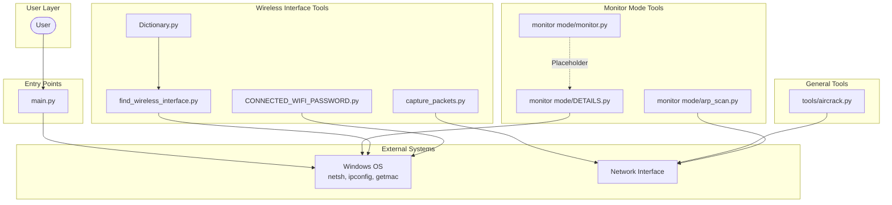
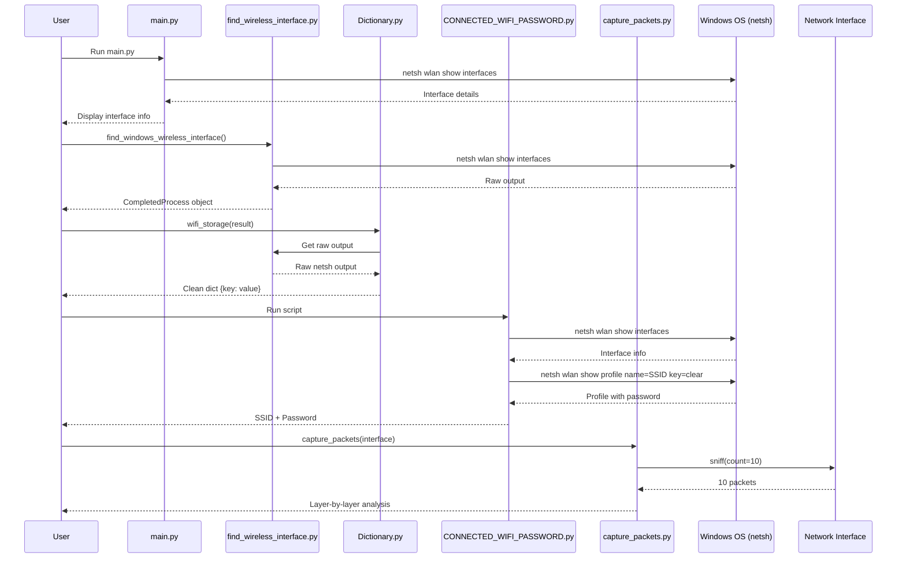

<div align="center">

# 🛡️ Wi-Fi Hacking Tool


**A comprehensive Windows-based toolkit for Wi-Fi security assessment, network analysis, and ethical hacking — built with Python and Scapy.**

> ⚠️ **IMPORTANT:** This tool is intended **ONLY** for ethical security testing on networks you own or have explicit permission to test. Unauthorized use is illegal.

</div>

---

## 📑 Table of Contents

- [Overview](#-overview)
- [Features](#-features)
- [Architecture](#-architecture)
- [Project Structure](#-project-structure)
- [Installation](#-installation)
- [Usage Guide](#-usage-guide)
- [Module Deep Dive](#-module-deep-dive)
- [Data Flow](#-data-flow)
- [Dependencies](#-dependencies)
- [Ethical Use Disclaimer](#-ethical-use-disclaimer)
- [License](#-license)
- [Author](#-author)

---

## 🔍 Overview

This project is a **modular Wi-Fi security toolkit** designed for **Windows environments**. It combines Windows native command-line utilities (`netsh`, `ipconfig`, `getmac`) with the powerful **Scapy** packet manipulation library to provide a suite of wireless network analysis and testing capabilities.

### What problem does it solve?

- **Discover** wireless interfaces and their properties on Windows
- **Retrieve** saved Wi-Fi network credentials (SSID & passwords)
- **Capture and analyze** network packets at multiple layers (Dot11, IP, TCP, UDP, ICMP)
- **Parse** network interface output into structured dictionaries
- **Scan** networks using ARP requests
- **Learn** about network protocol internals through hands-on experimentation

### Key Concepts

| Concept | Description |
|---------|-------------|
| **Wireless Interface Discovery** | Using `netsh wlan show interfaces` to detect connected Wi-Fi adapters |
| **Credential Retrieval** | Extracting saved SSID passwords via `netsh wlan show profile` |
| **Packet Sniffing** | Capturing live network traffic with Scapy's `sniff()` |
| **Protocol Analysis** | Inspecting Dot11, IP, TCP, UDP, and ICMP layers |
| **ARP Scanning** | Mapping devices on a local network segment |

---

## ✨ Features

- ✅ **Wireless Interface Detection** — Identify connected Wi-Fi adapters with detailed properties
- ✅ **Network Credential Recovery** — Extract SSID and saved passwords from Windows profiles
- ✅ **Live Packet Capture** — Sniff and analyze network traffic in real-time
- ✅ **Multi-layer Protocol Parsing** — Dot11, IP, TCP, UDP, ICMP, and Ethernet header analysis
- ✅ **MAC Address Lookup** — Retrieve physical addresses via `getmac` and `ipconfig`
- ✅ **Structured Network Data** — Parse raw `netsh` output into clean dictionaries
- ✅ **ARP Network Scanning** — Skeleton ARP scanner for local network discovery
- ✅ **Educational Examples** — Demonstrates Scapy packet crafting and sniffing techniques
- ✅ **Modular Architecture** — Independent, reusable components
- ✅ **Windows-native** — Leverages Windows command-line tools without extra dependencies

---

## 🏗️ Architecture



---

## 📁 Project Structure

```
Wi-Fi-Security-Toolkit/
│
├── main.py                                  # 🚀 Entry point - displays WLAN interface info
├── LICENSE                                  # 📄 MIT License
├── .gitignore                               # 🙈 Ignored files (whl, pycache, .vscode)
├── README.md                                # 📘 You are here
│
├── monitor mode/                            # 🔬 Monitor-mode & network utilities
│   ├── monitor.py                           #    (Placeholder - under development)
│   ├── DETAILS.py                           #    Network configuration details (MAC, IP)
│   └── arp_scan.py                          #    ARP Scanner class (skeleton)
│
└── tools/                                   # 🛠️ Core toolkits
    ├── aircrack.py                          #    Scapy packet crafting & sniffing demo
    │
    └── find_wireless_interface/             # 📡 Wireless interface package
        ├── __init__.py                      #    Package exports
        ├── find_wireless_interface.py       #    Netsh WLAN interface finder
        ├── CONNECTED_WIFI_PASSWORD.py       #    🔑 SSID & password recovery
        ├── capture_packets.py               #    📡 Live packet capture & analysis
        └── Dictionary.py                    #    📖 Netsh output → structured dict
```

---

## 💾 Installation

### Prerequisites

- **Operating System:** Windows 10/11 (required for `netsh` commands)
- **Python:** 3.8 or higher
- **Administrator Privileges:** Required for packet capture operations

### Step 1: Clone the Repository

```bash
git clone https://github.com/yourusername/wifi-hacking-tool.git
cd wifi-hacking-tool
```

### Step 2: Install Dependencies

```bash
pip install scapy
```

> **Note:** Scapy is required for packet capture functionality. On Windows, Scapy works with Npcap. Install [Npcap](https://npcap.com/) if you plan to use packet capture features.

### Step 3: Verify Installation

```bash
python main.py
```

If the installation is successful, you should see your wireless interface information displayed.

---

## 🚀 Usage Guide

### 1. Display Wireless Interface Information

Run the main entry point to see your connected Wi-Fi adapter details:

```bash
python main.py
```

**Example Output:**
```
Name                   : Wi-Fi
SSID                   : MyNetwork
BSSID                  : aa:bb:cc:dd:ee:ff
Signal                 : 95%
Radio type             : 802.11n
Authentication         : WPA2-Personal
Cipher                 : CCMP
```

### 2. Find Wireless Interface (Programmatic)

```python
from tools.find_wireless_interface import find_windows_wireless_interface

result = find_windows_wireless_interface()
if result:
    print(result.stdout)
else:
    print("No wireless interface detected.")
```

### 3. Parse Interface Details into a Dictionary

```python
from tools.find_wireless_interface.Dictionary import wifi_storage
from tools.find_wireless_interface import find_windows_wireless_interface

result = find_windows_wireless_interface()
details = wifi_storage(result)

print(f"SSID: {details.get('SSID')}")
print(f"Signal: {details.get('Signal')}")
print(f"MAC: {details.get('Physical address')}")
```

### 4. Retrieve Connected Wi-Fi Password

```bash
python tools/find_wireless_interface/CONNECTED_WIFI_PASSWORD.py
```

**Example Output:**
```
--- Wi-Fi Password Retriever ---
Connected SSID: MyNetwork
Wi-Fi Password: MySecretPassword123
```

### 5. Capture and Analyze Live Packets

```bash
python tools/find_wireless_interface/capture_packets.py
```

This will capture 10 packets on your default interface and print detailed layer-by-layer analysis for each packet, including:

- **Dot11 Layer** — Source MAC, Destination MAC, BSSID
- **Dot11Elt Layer** — SSID information
- **IP Layer** — Source/Destination IP, TTL, protocol, flags
- **TCP/UDP** — Port numbers
- **ICMP** — Type and code

### 6. View Network Configuration Details

```bash
python "monitor mode/DETAILS.py"
```

Select option **1** for full IP configuration or **2** for MAC address only.

### 7. Run Scapy Packet Demos

```bash
python tools/aircrack.py
```

This demonstrates:
- Crafting IP/ICMP packets
- Crafting UDP packets with custom payload
- Sending packets and receiving responses
- Sniffing live packets

---

## 🧩 Module Deep Dive

### `main.py` — Entry Point

The main entry point uses `subprocess` to run `netsh wlan show interfaces` and displays the output. It serves as a quick verification that the system has a working Wi-Fi interface.

```python
import subprocess as sp

dictionary = {
    "SSID": ["netsh", "wlan", "show", "interfaces"]
}
result = sp.run(dictionary["SSID"], capture_output=True, text=True, check=True)
print(result.stdout)
```

### `tools/find_wireless_interface/` — Wireless Interface Package

This package contains the core wireless functionality:

#### `find_wireless_interface.py`
- **Function:** `find_windows_wireless_interface()`
- Runs `netsh wlan show interfaces` and returns the `subprocess.CompletedProcess` result
- Returns `None` if the command fails (non-Windows system, Wi-Fi off, etc.)
- Includes error handling for `CalledProcessError` and general exceptions

#### `Dictionary.py`
- **Function:** `wifi_storage(result)` — Parses raw `netsh` output into a clean `dict[str, str]`
- Filters out irrelevant lines (empty lines, separator lines, error messages)
- Splits each line at the first `:` to create key-value pairs
- Provides targeted dictionary access for properties like `Signal`, `Name`, `SSID`, `BSSID`, `Authentication`, `Cipher`, `Channel`, etc.
- **Function:** `_load_local_module()` — Dynamically loads the `find_wireless_interface.py` module

#### `CONNECTED_WIFI_PASSWORD.py`
- **Function:** `get_current_wifi_ssid()` — Parses `netsh wlan show interfaces` output to find the connected SSID
- **Function:** `get_wifi_password(ssid)` — Runs `netsh wlan show profile name={ssid} key=clear` and extracts the `Key Content` field
- Returns `None` gracefully if any step fails
- Beginner-friendly with clear docstrings and comments

#### `capture_packets.py`
- **Function:** `capture_packets(interface)` — Captures 10 packets on the specified interface using Scapy's `sniff()`
- Performs detailed layer-by-layer analysis for each packet:
  - **Dot11:** Source MAC, Destination MAC, BSSID
  - **Dot11Elt:** SSID, SSID length, raw bytes, hex representation
  - **IP:** Source/Destination IP, TTL, version, header length, flags, fragment offset, checksum
  - **TCP:** Source/Destination ports
  - **UDP:** Source/Destination ports
  - **ICMP:** Type and code
- Prints packet length and summary for each captured packet

### `tools/aircrack.py` — Scapy Demonstrations

This script demonstrates Scapy's capabilities:
- **Packet Crafting:** Creates IP/ICMP packets with `IP(dst="google.com")/ICMP()` and UDP packets with custom payloads
- **Packet Sending:** Uses `srp()` to send/receive packets at layer 2
- **Packet Sniffing:** Captures 10 packets with `sniff()` and displays summaries

### `monitor mode/DETAILS.py` — Network Configuration

- Interactive script that accepts user input (1 or 2)
- **Option 1:** Runs `ipconfig /all` — shows complete network configuration
- **Option 2:** Runs `getmac /v` — shows MAC addresses only
- Includes error handling with friendly error messages

### `monitor mode/arp_scan.py` — ARP Scanner (Skeleton)

- **Class:** `ARPScanner` — A skeleton class for future ARP scanning functionality
- Currently has an empty `__init__` method
- Designed to use Scapy's `ARP` and `Ether` layers with `srp()` for network discovery

### `monitor mode/monitor.py` — Monitor Mode (Placeholder)

- Empty file — placeholder for future monitor mode implementation

---

## 🔄 Data Flow



---

## 📦 Dependencies

| Dependency | Version | Purpose |
|------------|---------|---------|
| **Python** | 3.8+ | Core language |
| **Scapy** | 2.7.0+ | Packet capture, crafting, and analysis |
| **Npcap** | Latest | Windows packet capture driver (required by Scapy) |
| **Windows OS** | 10/11 | Native `netsh`, `ipconfig`, `getmac` commands |

### Installing Dependencies

```bash
# Install Scapy
pip install scapy

# Install Npcap (required for packet capture on Windows)
# Download from: https://npcap.com/
```

---

## ⚠️ Ethical Use Disclaimer

This software is provided for **educational purposes** and **authorized security testing only**.

By using this toolkit, you agree to:

1. **Only test networks you own** or have explicit written permission to test
2. **Comply with all applicable laws** in your jurisdiction regarding network security testing
3. **Not use this tool** for any illegal or unauthorized purpose
4. **Accept full responsibility** for any consequences resulting from the use of this software

> **Unauthorized access to computer networks is a crime** in most jurisdictions under laws such as:
> - The Computer Fraud and Abuse Act (CFAA) in the United States
> - The Computer Misuse Act in the United Kingdom
> - Similar legislation in other countries

The developers assume **no liability** and are **not responsible** for any misuse of this program.

---

## 📄 License

This project is licensed under the **MIT License**.

```
MIT License

Copyright (c) 2026 ALI IBRAHIM

Permission is hereby granted, free of charge, to any person obtaining a copy
of this software and associated documentation files (the "Software"), to deal
in the Software without restriction, including without limitation the rights
to use, copy, modify, merge, publish, distribute, sublicense, and/or sell
copies of the Software, and to permit persons to whom the Software is
furnished to do so, subject to the following conditions:

The above copyright notice and this permission notice shall be included in all
copies or substantial portions of the Software.

THE SOFTWARE IS PROVIDED "AS IS", WITHOUT WARRANTY OF ANY KIND, EXPRESS OR
IMPLIED, INCLUDING BUT NOT LIMITED TO THE WARRANTIES OF MERCHANTABILITY,
FITNESS FOR A PARTICULAR PURPOSE AND NONINFRINGEMENT. IN NO EVENT SHALL THE
AUTHORS OR COPYRIGHT HOLDERS BE LIABLE FOR ANY CLAIM, DAMAGES OR OTHER
LIABILITY, WHETHER IN AN ACTION OF CONTRACT, TORT OR OTHERWISE, ARISING FROM,
OUT OF OR IN CONNECTION WITH THE SOFTWARE OR THE USE OR OTHER DEALINGS IN THE
SOFTWARE.
```

---

## 👤 Author

**ALI IBRAHIM**

- 📧 Email: alibraheem064@gmail.com
- 🐙 GitHub: https://github.com/Ali-king-cloud

---

<div align="center">

**Made with ❤️ for the ethical hacking community**

*If you find this project useful, please consider giving it a ⭐ on GitHub!*

</div>
